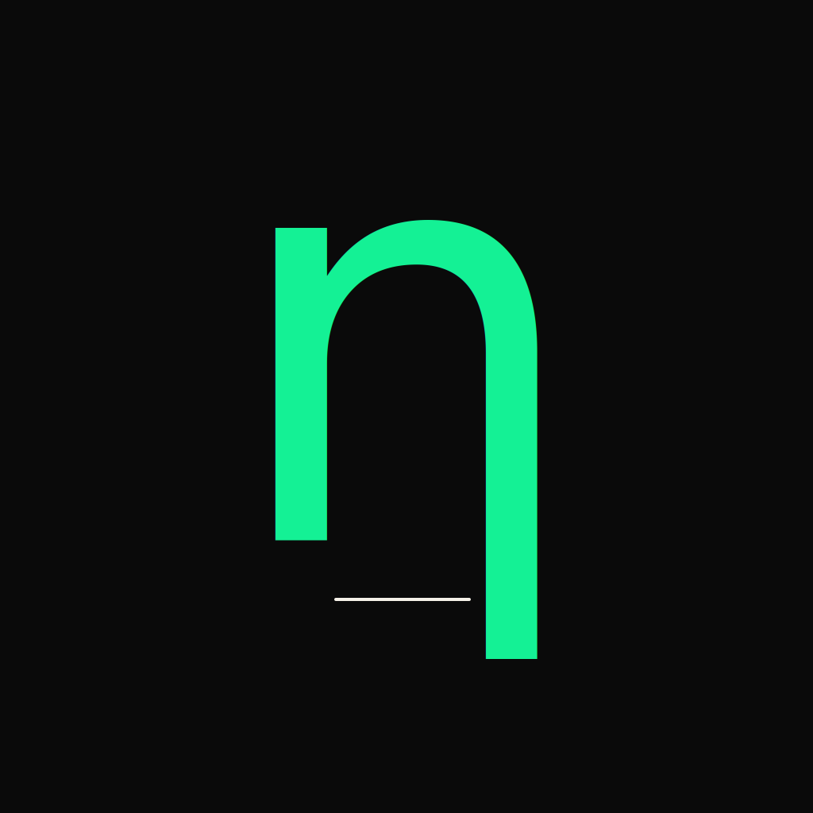

<div align="center">



# Noethrion

**An open standard for hardware-attested verification of clean energy generation.**

[](LICENSE)
[](#current-status)
[](docs/whitepaper.html)
[](https://github.com/noethrion/noethrion/actions/workflows/ci.yml)
[](https://github.com/noethrion/noethrion/actions/workflows/security.yml)
[](docs/audit/smart-contracts-audit.md)
[](contracts/test/NoethrionAttester.halmos.t.sol)
[](https://github.com/noethrion/noethrion/discussions)

[Whitepaper](docs/whitepaper.html) · [Constitution](docs/constitution.html) · [Brand Book](docs/brand-book-v0.3.html) · [Spec v0.1](spec/noethrion-attestation-v0.1.md) · [Quickstart](QUICKSTART.md) · [Examples](EXAMPLES.md) · [FAQ](FAQ.md) · [Threat Model](THREAT_MODEL.md) · [ADRs](docs/adr/) · [Roadmap](ROADMAP.md) · [Changelog](CHANGELOG.md) · [Discussions](https://github.com/noethrion/noethrion/discussions) · [Website](https://noethrion.com)

</div>

---

## 🇺🇸 English

### What is Noethrion?

Noethrion is an open standard for hardware-attested verification of electricity generation. The protocol allows producers, consumers, and regulators to cryptographically verify the source and timing of any kilowatt-hour through digital signatures originating at hardware secure elements installed adjacent to electricity meters.

NOET is the unit of accounting in the protocol, representing one verified kilowatt-hour. It is not designed as a payment instrument, store-of-value asset, or monetary alternative — it is a verifiable attestation token used internally by the protocol for accounting, audit, and traceability.

A verification layer for energy attestation — analogous to how DNS verifies domain ownership and how X.509 certificates verify identity.

It is infrastructure that serves the existing world — like ICANN serves DNS, like Bluetooth SIG serves wireless protocols.

### Why now

The convergence of two trends makes this urgent:

- **Compute infrastructure scale-up:** large-scale data center operators have committed to over 10 GW of nuclear power purchase agreements in the past year. Operators in this sector require cryptographically verifiable provenance of energy used to substantiate their sustainability claims.
- **Carbon regulation:** EU CBAM entered force on January 1, 2026. Goods imported into the EU now require carbon attestation at the source. The era of carbon estimation is ending.

The existing system — RECs, Guarantees of Origin, I-RECs — operates on annual matching, spreadsheet trading, and absent device-level attestation. It is structurally insufficient for what is coming.

### How it works (technical summary)

1. A secure element (~$0.87 in volume — Microchip ATECC608B or similar) sits adjacent to a kilowatt-hour meter.
2. Every 60 seconds, the chip signs a tuple `(kWh_delta, timestamp, deviceID)` with ECDSA P-256.
3. The private key never leaves the silicon.
4. Signatures batch into Merkle trees and anchor to an EVM-compatible Layer 2 settlement network every ~10 minutes.
5. Anyone, anywhere, with the device's public key can verify any single attestation in under a second.
6. Each verified kWh produces a corresponding NOET attestation token, recorded on-chain through a deterministic, rule-based protocol with no discretionary issuance.

Read the full [whitepaper](docs/whitepaper.html) for cryptographic details, threat model, and economic design.

### Scope of the protocol

Noethrion provides:
- Cryptographic attestation of electricity generation at the device level
- Verifiable provenance for clean energy claims
- A standardized format for energy data that integrators, auditors, and regulators can rely on

Noethrion does not provide: payment rails, energy trading, market-making, currency issuance, or general-purpose smart contracts.

### Current status

| Component | Status |
|---|---|
| Whitepaper v0.1 | ✅ Published |
| Constitution v0.1 | ✅ Published |
| Brand Book v0.3 | ✅ Published |
| Reference architecture | ✅ Documented |
| Internet-Draft v0.1 | ✅ Draft published (RATS WG submission pending review) |
| Smart contracts | ✅ Beta — `claim()` + m-of-n quorum + admin slashing + 127/127 forge tests + 25/25 Halmos symbolic proofs (every public function pinned, including the no-retroactive-shrink guarantee on both threshold and challenge window); pre-audit readiness doc at `docs/audit/smart-contracts-audit.md`; production deploy + incident-response runbooks at `docs/runbooks/` |
| Hardware POC firmware | ✅ Skeleton — ESP32 + ATECC608B probe-only, bring-up pending |
| Reference tools (CLI + libraries) | ✅ Published (Python, TypeScript, Solidity) |
| Threat model + ADRs | ✅ Published |
| Hardware vendor evaluation | ✅ Published |
| Multi-client implementations | 📋 Planned (3+ targeted) |
| Smart contract third-party audit | 📋 Funded via grant track; before v1.0 mainnet |
| m-of-n validator quorum | ✅ Shipped (v0.2 reference contract) |
| Post-quantum migration | 📋 v0.2+ (prototype on grant roadmap) |

### Roadmap

**2026 H1 (Q2-Q3) · Foundation Phase**
- Hardware POC working bench
- Smart contracts on EVM testnet
- IETF I-D submission to RATS WG
- First conference talks

**2026 H2 · Validation Phase**
- 5–10 partner integrations (residential solar inverters)
- Smart contracts audit
- Foundation legal entity (Delaware C-Corp Initial Development Co.)
- First grant approvals (Gitcoin, EF ESP)

**2027 · Launch Phase**
- Mainnet launch on an EVM-compatible Layer 2
- Liquidity Bootstrapping Pool (no presale, no team allocation discount)
- First commercial integration with an AI infrastructure operator
- Marshall Islands DAO LLC for token governance

**2028+ · Scale Phase**
- Switzerland Stiftung Foundation incorporation
- Initial Development Co. self-dissolution
- Multi-client ecosystem (3–5 reference clients)
- Founder transition to advisory

### Get involved

We are looking for:

- **Embedded engineers** experienced with secure elements (ATECC608, OPTIGA Trust M, EdgeLock SE050, NXP A71CH)
- **Solidity developers** comfortable with Foundry and security-first design on EVM Layer 2 networks
- **Energy systems engineers** with experience in grid balancing, RECs, or 24/7 CFE
- **Climate policy experts** tracking CBAM, EU Green Deal, US IRA implementation
- **Standards body participants** in IETF (RATS WG, SUIT WG), IEEE PES, IEC TC 57
- **Critical reviewers** — especially those who think this won't work

**Contact:** team@noethrion.com
**Discussions:** [github.com/noethrion/noethrion/discussions](https://github.com/noethrion/noethrion/discussions)

### Repository structure

```
noethrion/
├── README.md         this file
├── QUICKSTART.md     five-minute on-ramp
├── EXAMPLES.md       end-to-end protocol walkthrough
├── FAQ.md            30 anticipated launch-day questions
├── THREAT_MODEL.md   ten adversary classes + mitigations matrix
├── CONTRIBUTING.md / SECURITY.md / CODE_OF_CONDUCT.md / LICENSE
├── docs/             Whitepaper, Constitution, Brand Book, ADRs, hardware vendor matrix
│   ├── whitepaper.html / constitution.html / brand-book-v0.3.html / index.html (landing)
│   ├── adr/          five Architecture Decision Records (P-256, hardware, L2, Stiftung, no-sale)
│   └── hardware-vendor-matrix.md
├── spec/             IETF-style protocol specification
│   └── noethrion-attestation-v0.1.md
├── contracts/        Foundry — NoethrionAttester + NoethrionToken (Solidity 0.8.24, 127 forge tests + 25 Halmos symbolic checks)
├── firmware/         ESP32 + ATECC608B reference (PlatformIO, probe-only skeleton)
├── examples/         end-to-end lifecycle + integrator templates (Python / TS / Solidity)
├── tools/            Python CLI — provision, verify, render social assets
├── assets/           SVG logos (D / E / F / G categories), social card sources
└── .github/          CI (lint + Foundry tests), Cloudflare Pages deploy workflow
```

### License

[MIT License](LICENSE) · Copyright © 2026 Noethrion contributors.

The protocol specification is intended to remain open and license-permissive in perpetuity.

### Security

For security disclosures, see [SECURITY.md](SECURITY.md). Email: security@noethrion.com.

---

## 🇷🇺 Русский

### Что такое Noethrion?

Noethrion — открытый стандарт для аппаратно-подтверждённой верификации генерации электричества. Протокол позволяет производителям, потребителям и регуляторам криптографически верифицировать источник и время генерации любого киловатт-часа через цифровые подписи у hardware secure elements, установленных рядом с электросчётчиками.

NOET — единица учёта в протоколе, представляющая один верифицированный киловатт-час. Это не платёжный инструмент, не store-of-value актив и не монетарная альтернатива — это верификационный токен аттестации, используемый внутри протокола для учёта, аудита и traceability.

Слой верификации для энергетической аттестации — аналогично тому как DNS верифицирует владение доменом, а X.509 сертификаты верифицируют identity.

Это инфраструктура, которая обслуживает существующий мир — как ICANN обслуживает DNS, как Bluetooth SIG обслуживает беспроводные протоколы.

### Почему сейчас

Конвергенция двух трендов делает это срочным:

- **Масштабирование compute infrastructure:** операторы дата-центров крупного масштаба подписали более 10 ГВт ядерных PPA за последний год. Операторам этого сектора нужно криптографически верифицируемое подтверждение происхождения энергии для substantiate их sustainability claims.
- **Углеродное регулирование:** EU CBAM вступил в силу 1 января 2026 года. Товары, импортируемые в ЕС, теперь требуют атестации углеродного следа у источника. Эра оценки углерода заканчивается.

Существующая система — RECs, Guarantees of Origin, I-RECs — работает на годовом сопоставлении, торговле через таблицы, без device-level аттестации. Структурно недостаточна для того что грядёт.

### Как это работает (технически кратко)

1. Secure element (~$0.87 в объёме — Microchip ATECC608B или аналог) располагается рядом с электросчётчиком.
2. Каждые 60 секунд чип подписывает кортеж `(kWh_delta, timestamp, deviceID)` через ECDSA P-256.
3. Приватный ключ никогда не покидает кремний.
4. Подписи батчатся в Merkle деревья и анкорятся в EVM-совместимый Layer 2 settlement-network каждые ~10 минут.
5. Любой, где угодно, с публичным ключом устройства может проверить любую отдельную аттестацию менее чем за секунду.
6. Каждый верифицированный кВт·ч производит соответствующий NOET attestation токен, записываемый on-chain через детерминированный rule-based протокол без discretionary эмиссии.

Полный [whitepaper](docs/whitepaper.html) — криптографические детали, threat model, экономический дизайн.

### Область применения протокола

Noethrion обеспечивает:
- Криптографическую аттестацию генерации электричества на уровне устройства
- Верифицируемое происхождение для clean energy claims
- Стандартизированный формат энергетических данных, на который могут полагаться интеграторы, аудиторы и регуляторы

Noethrion не предоставляет: payment rails, energy trading, market-making, эмиссию валюты, general-purpose smart contracts.

### Текущий статус

| Компонент | Статус |
|---|---|
| Whitepaper v0.1 | ✅ Опубликован |
| Constitution v0.1 | ✅ Опубликована |
| Brand Book v0.3 | ✅ Опубликован |
| Reference architecture | ✅ Документирована |
| Internet-Draft v0.1 | ✅ Draft опубликован (submission в RATS WG после review) |
| Smart contracts | ✅ Beta — `claim()` + m-of-n кворум + admin slashing + 127/127 forge тестов + 25/25 Halmos symbolic proofs (каждая публичная функция contract'а pinned, включая no-retroactive-shrink гарантию на threshold и challenge window); pre-audit readiness doc в `docs/audit/smart-contracts-audit.md`; production deploy + incident-response runbooks в `docs/runbooks/` |
| Hardware POC firmware | ✅ Skeleton — ESP32 + ATECC608B probe-only, bring-up в очереди |
| Reference tools (CLI + libraries) | ✅ Опубликованы (Python, TypeScript, Solidity) |
| Threat model + ADRs | ✅ Опубликованы |
| Hardware vendor evaluation | ✅ Опубликовано |
| Multi-client implementations | 📋 Запланировано (3+ targeted) |
| Smart contract third-party audit | 📋 Через grant track; до v1.0 mainnet |
| m-of-n validator quorum | ✅ Shipped (v0.2 reference contract) |
| Post-quantum migration | 📋 v0.2+ (prototype в grant roadmap) |

### Roadmap

**2026 H1 (Q2-Q3) · Foundation Phase**
- Hardware POC рабочий стенд
- Smart contracts на EVM testnet
- IETF I-D submission в RATS WG
- Первые conference talks

**2026 H2 · Validation Phase**
- 5–10 partner интеграций (residential solar inverters)
- Аудит smart contracts
- Foundation legal entity (Delaware C-Corp Initial Development Co.)
- Первые grant approvals (Gitcoin, EF ESP)

**2027 · Launch Phase**
- Mainnet launch на EVM-совместимый Layer 2
- Liquidity Bootstrapping Pool (без presale, без team allocation discount)
- Первая коммерческая интеграция с AI infrastructure оператором
- Marshall Islands DAO LLC для token governance

**2028+ · Scale Phase**
- Switzerland Stiftung Foundation incorporation
- Initial Development Co. самораспуск
- Multi-client ecosystem (3–5 reference clients)
- Founder переход в advisory

### Как присоединиться

Мы ищем:

- **Embedded инженеров** с опытом в secure elements (ATECC608, OPTIGA Trust M, EdgeLock SE050, NXP A71CH)
- **Solidity разработчиков** свободно владеющих Foundry, security-first дизайном на EVM Layer 2 сетях
- **Energy systems инженеров** с опытом в grid balancing, RECs или 24/7 CFE
- **Climate policy экспертов** отслеживающих CBAM, EU Green Deal, US IRA implementation
- **Участников standards bodies** в IETF (RATS WG, SUIT WG), IEEE PES, IEC TC 57
- **Критических ревьюеров** — особенно тех кто думает что это не сработает

**Контакт:** team@noethrion.com
**Discussions:** [github.com/noethrion/noethrion/discussions](https://github.com/noethrion/noethrion/discussions)

### Структура репозитория

```
noethrion/
├── README.md         this file
├── QUICKSTART.md     five-minute on-ramp
├── EXAMPLES.md       end-to-end protocol walkthrough
├── FAQ.md            30 anticipated launch-day questions
├── THREAT_MODEL.md   ten adversary classes + mitigations matrix
├── CONTRIBUTING.md / SECURITY.md / CODE_OF_CONDUCT.md / LICENSE
├── docs/             Whitepaper, Constitution, Brand Book, ADRs, hardware vendor matrix
│   ├── whitepaper.html / constitution.html / brand-book-v0.3.html / index.html (landing)
│   ├── adr/          five Architecture Decision Records (P-256, hardware, L2, Stiftung, no-sale)
│   └── hardware-vendor-matrix.md
├── spec/             IETF-style protocol specification
│   └── noethrion-attestation-v0.1.md
├── contracts/        Foundry — NoethrionAttester + NoethrionToken (Solidity 0.8.24, 127 forge tests + 25 Halmos symbolic checks)
├── firmware/         ESP32 + ATECC608B reference (PlatformIO, probe-only skeleton)
├── examples/         end-to-end lifecycle + integrator templates (Python / TS / Solidity)
├── tools/            Python CLI — provision, verify, render social assets
├── assets/           SVG logos (D / E / F / G categories), social card sources
└── .github/          CI (lint + Foundry tests), Cloudflare Pages deploy workflow
```

### Лицензия

[MIT License](LICENSE) · Copyright © 2026 Noethrion contributors.

Спецификация протокола задумана как открытая и license-permissive бессрочно.

### Безопасность

Для security disclosures смотри [SECURITY.md](SECURITY.md). Email: security@noethrion.com.

---

<div align="center">

**η = E_useful / E_total**

*Every kilowatt-hour deserves a signature.*
*Каждый киловатт-час заслуживает подписи.*

[noethrion.com](https://noethrion.com) · [@noethrion](https://twitter.com/noethrion) · [paragraph.com/@noethrion](https://paragraph.com/@noethrion)

</div>
